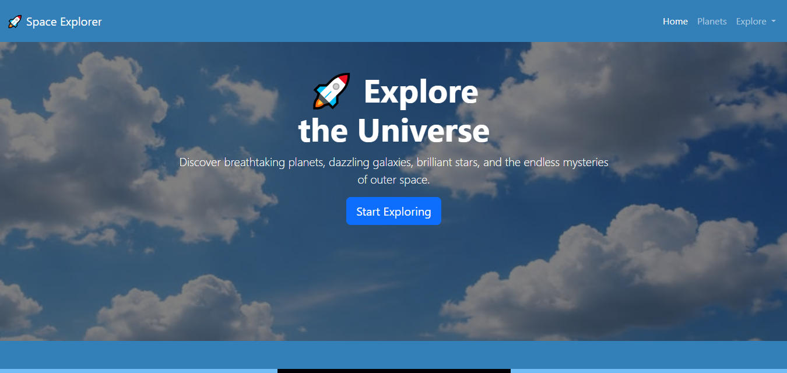

# 🚀 Space Explorer



A modern and responsive **Space Explorer** website built with **HTML**, **CSS**, and **Bootstrap 5**. This project was created to practice Bootstrap components while building a beautiful space-themed landing page.

## ✨ Features

* 🚀 Responsive Navigation Bar
* 🌌 Hero Section with Space Background
* 🪐 Planet Image Carousel
* 🌍 Responsive Planet Cards
* 📖 Interactive Space Facts Accordion
* 📩 Contact Form
* 🌙 Modern Footer
* 📱 Fully Responsive Design

## 🛠️ Technologies Used

* HTML5
* CSS3
* Bootstrap 5

## 🎯 Project Goal

The goal of this project was to improve my Bootstrap skills by building a responsive website using Bootstrap components while creating a modern, responsive, and visually appealing design.

## 📁 Folder Structure

```text
Space-Explorer/
│── index.html
│── style.css
│── README.md
│
└── images/
    │── hero-img.jpg
    │── Earth.jpg
    │── Mars.jpg
    │── Saturn.jpg
    │── Jupiter.jpg
    │── preview.PNG
```

## 📱 Responsive Design

This website is fully responsive and adapts to different screen sizes using Bootstrap's grid system and responsive utilities.

## 👩‍💻 Author

**Maryam Arshad**

---

⭐ Thank you for checking out this project! Feel free to explore the code and leave a star if you enjoyed it.

